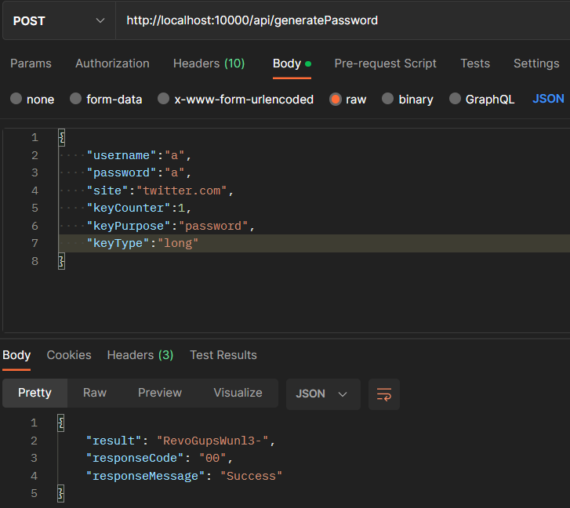

# Spectre-Go
Unofficial repository, re-create  [Spectre app](https://spectre.app/), based on Go language.

### Important Notes:
This repo just for my own learning purpose, **don't use this repo for generating your real password**. 
Please use the official one in https://spectre.app/ . I don't responsible for anything bad could be happened by using this repo.

## Introduction
### What is Spectre?
Spectre brings a stateless cryptographic identity algorithm to you across multiple platforms.

### How does it work?
With just username and spectre secret (master password), you don't have to remember all site / app passwords.

Better try to test the app in https://spectre.app

### Original Features
There's some features in spectre:

- Choosing what you want to generate. It could be:

  - Short, Medium, Long, Max length password
  - Pin
  - Phrases (for security answer)
  - Name
- Set the keyCounter, to get different result in the same site. It's really useful for updating your password regularly.
- All passwords are 100% generated locally.


## Spectre-go 

### What's inside this repo?

The repo contains main spectre algorithm to generate password. This repo based on newest algorithm version V3(2015:01)
You'll get the same generated password. 

I made this using go language, to generate the password, you'll need to send the request via REST API, or you can modify the code, so you can do that locally.

Example request:
```json
{
    "username":"a",
    "password":"a",
    "site":"twitter.com",
    "keyCounter":1,
    "keyPurpose":"com.lyndir.masterpassword",
    "keyType":"long"
}
```

Example response:
```json
{
    "result": "RevoGupsWunl3-"
}
```

Result example:



The official one:


### How I recreate this app?
- There's many option to see the algorithm implmentation in android, iOS, web, CLI, etc. I choose the implementation by using web. (Since it's easier to debug)
- I try to understand the flow of how the spectre generate the password, and here's the main flow of spectre web:

- Since I understand python, and it's really simple for experiment with that, I try to do the Proof Of Concept, by implement that. you can check the POC in `docs/spectre_poc.py`
- When the python code already work properly, I try to recreate that using Go language. 

### How the algorithms work


It's consist of 3 main function:
- newUserKey : generate userKeyData using [Scrypt](https://en.wikipedia.org/wiki/Scrypt)
- newSiteKey : generate siteKey, based on userKeyData, and other params. Use [HMAC-SHA256](https://en.wikipedia.org/wiki/HMAC)
- newSiteResult : generate password based on siteKey and choosen templates.

The value of siteKey will be module to get character based on the position 

```go
func NewSiteResult(params models.GenSiteParam) string {
	userKey := newUserKey(params.Username, params.Password, params.KeyPurpose)
	siteKey := newSiteKey(userKey, params.Site, params.KeyCounter, params.KeyPurpose, "")
	
	resTemplates := templates[params.KeyType] // e.g. "CvcnoCvc"
	resTemplate := resTemplates[int(siteKey[0])%len(resTemplates)]
	
	var passRes strings.Builder
	for i := 0; i < len(resTemplate); i++ { // e.g. "C" -> "BCDFGH..." (Consonant template)
		currChar := characters[string(resTemplate[i])] // 
		idx := int(siteKey[i+1]) % len(currChar)
		passRes.WriteRune([]rune(currChar)[idx])
	}

	return passRes.String()
}
```
### Different with the official one:
#### Using REST API
It's based on REST API for generate the password. Sure, it's not as safe as generated locally.

#### Caching using Redis
I'm doing experiment, by using redis for saving generated password temporarly, 
it's boost the speed when doing the generating for the same password, again, and again. Really suitable for people with Short-term memory loss ✌️✌️. 

Benchmark result (with same payload, without cache)
```
BenchmarkNewSiteResult/Benchmark_[0]-8                 9         117841211 ns/op
BenchmarkNewSiteResult/Benchmark_[1]-8                 9         122222889 ns/op
BenchmarkNewSiteResult/Benchmark_[2]-8                 8         132624288 ns/op
BenchmarkNewSiteResult/Benchmark_[3]-8                 8         143758375 ns/op
```
Benchmark result (with same payload, using redis)
```
BenchmarkNewSiteResult/Benchmark_[0]-8             51892             21860 ns/op
BenchmarkNewSiteResult/Benchmark_[1]-8             49790             21805 ns/op
BenchmarkNewSiteResult/Benchmark_[2]-8             49364             23251 ns/op
BenchmarkNewSiteResult/Benchmark_[3]-8             53013             21976 ns/op
```

After doing this, I wondering, save cache feature could really affect the performance, when all of the payload different? So I'm experimenting, by using random UUID as the payload, and here's the benchmark result:
```
Benchmark_intTest_genPassword_withCache-8              4         258348300 ns/op
Benchmark_intTest_genPassword_withOutCache-8           4         253538875 ns/op
```


### Future work:
- Implement HTTPS, you don't want your plain password intercepted by someone (at least your own Burpsuite) right? 
- Creating docker image, so you can run the container, in CLI / REST mode
- Edit the API request structure. 
- Adding more feature, validation and enhance the code
- Creating a nice web GUI. Nice GUI definition for me is: you can use the web easily. You don't have to be worry with the fancy animation effect, color. I won't create that. 

### Credit:
https://gitlab.com/spectre.app
